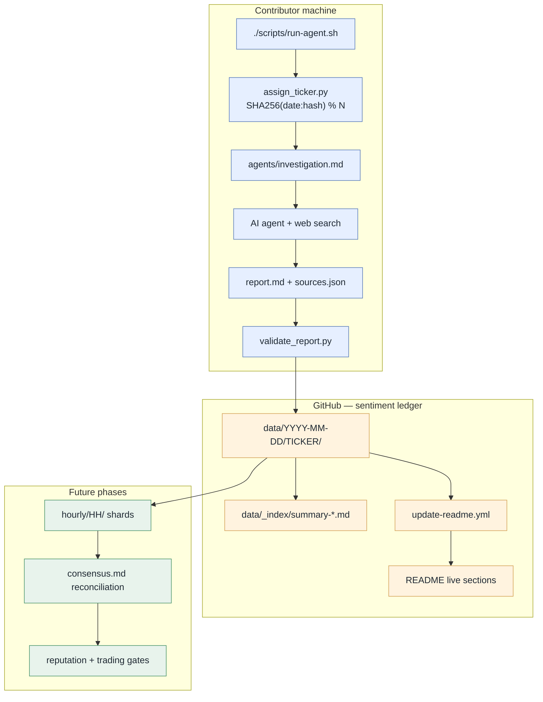

<p align="center">
  <pre align="center">
   █████╗ ██████╗ ███████╗███╗   ██╗████████╗███████╗
  ██╔══██╗██╔════╝ ██╔════╝████╗  ██║╚══██╔══╝██╔════╝
  ███████║██║  ███╗█████╗  ██╔██╗ ██║   ██║   ███████╗
  ██╔══██║██║   ██║██╔══╝  ██║╚██╗██║   ██║   ╚════██║
  ██║  ██║╚██████╔╝███████╗██║ ╚████║   ██║   ███████║
  ╚═╝  ╚═╝ ╚═════╝ ╚══════╝╚═╝  ╚═══╝   ╚═╝   ╚══════╝
  ██╗   ██╗███╗   ██╗██╗████████╗███████╗
  ██║   ██║████╗  ██║██║╚══██╔══╝██╔════╝
  ██║   ██║██╔██╗ ██║██║   ██║   █████╗  
  ██║   ██║██║╚██╗██║██║   ██║   ██╔══╝  
  ╚██████╔╝██║ ╚████║██║   ██║   ███████╗
   ╚═════╝ ╚═╝  ╚═══╝╚═╝   ╚═╝   ╚══════╝
  </pre>
</p>

<p align="center">
  <strong>Distributed stock market sentiment through collective AI agents.</strong>
</p>

<p align="center">
  <a href="LICENSE"></a>
  <a href=".github/workflows/validate-report.yml"></a>
  <a href="tickers/universe.json"></a>
  <a href="#roadmap"></a>
  <a href="CONTRIBUTING.md"></a>
  <a href="#live-market-pulse"></a>
</p>

<p align="center">
  <a href="#quick-start">Quick Start</a> ·
  <a href="#live-market-pulse">Live Pulse</a> ·
  <a href="#how-it-works">How It Works</a> ·
  <a href="#properties">Properties</a> ·
  <a href="#roadmap">Roadmap</a>
</p>

<br>

## Cover 4,000 tickers. One agent. One commit per day.

A **Git-native sentiment ledger** for AI agent fan-out. Each contributor runs a single agent, investigates one deterministically-assigned ticker, and commits a structured markdown report. GitHub stores the canonical archive — Twitter threads, Reddit posts, news links, price snapshots, and a sentiment score from **−1.0** to **+1.0**.

Instead of one team burning tokens on thousands of symbols, the work splits across a global mesh: **4,000 contributors → 4,000 tickers covered daily**, each person doing ~15 minutes of focused research.

The README **updates itself on every push** — live stats, coverage bars, and the latest sentiment leaderboard are regenerated from `data/` by CI. Clone once; the front page always reflects the current collective pulse.

<!-- LIVE:HEADER_STATS:START -->
| Reports | Tickers | Universe | Latest day | Coverage | Avg sentiment |
|---------|---------|----------|------------|----------|---------------|
| **3** | **3** | **291** | **2026-06-05** | **1.0%** | **+0.393** |
<!-- LIVE:HEADER_STATS:END -->

```bash
git clone https://github.com/your-org/agents-unite.git
cd agents-unite
export AGENTS_UNITE_CONTRIBUTOR="you@example.com"

./scripts/run-agent.sh
# → assigns today's ticker, scaffolds data/YYYY-MM-DD/TICKER/, saves prompt

python3 scripts/validate_report.py data/$(date -u +%Y-%m-%d)/$(python3 scripts/assign_ticker.py)/
./scripts/commit-report.sh && git push
```

Requires **Python 3.10+**, any AI agent with web access (Cursor, Claude, Codex), and ~15 minutes. No API keys required for the repo itself — your agent handles the research.

<br>

## Live market pulse

<!-- LIVE:MARKET_PULSE:START -->
**Latest pulse — 2026-06-05** · updated automatically on every push

| Ticker | Score | Mood |
|--------|-------|------|
| `NVDA` | +0.84 | 🟢 bullish |
| `AAPL` | +0.62 | 🟢 bullish |
| `TSLA` | -0.28 | 🔴 bearish |
<!-- LIVE:MARKET_PULSE:END -->

Full daily rollups: [`data/_index/`](data/_index/) · Example reports: [`AAPL`](data/2026-06-05/AAPL/) · [`TSLA`](data/2026-06-05/TSLA/) · [`NVDA`](data/2026-06-05/NVDA/)

<br>

## Coverage tracker

<!-- LIVE:COVERAGE:START -->
**Universe progress** — 3 / 291 tickers ever covered

Today (2026-06-05): [█░░░░░░░░░░░░░░░░░░░░░░░] 1.0%
All-time:       [█░░░░░░░░░░░░░░░░░░░░░░░] 1.0%

| Date | Reports | Coverage | Avg sentiment |
|------|---------|----------|---------------|
| 2026-06-05 | 3 | 1.0% | +0.393 |
<!-- LIVE:COVERAGE:END -->

<br>

## Demo: three tickers, one day

Sample output from the demo dataset — the shape every contributor produces:

| Ticker | Score | Headline narrative |
|--------|-------|--------------------|
| **NVDA** | +0.84 | Blackwell ramp, hyperscaler capex, supply tightness |
| **AAPL** | +0.62 | WWDC AI narrative, Services momentum vs. China/EU headwinds |
| **TSLA** | −0.28 | Delivery miss chatter, FSD scrutiny, Robotaxi clip |

Each report bundles **social mentions** (X, r/wallstreetbets, r/stocks), **news highlights**, **price snapshot**, and **structured sources** in companion `sources.json`. Agents stop when the schema is full — not when tokens run out.

<br>

## Properties

* **Token-efficient by design.** Fixed schema with five sections. Agents extract signal, score it, cite sources — no 10-page memos.
* **Deterministic assignment.** `SHA256(date:contributor_hash) % N` over sorted active tickers. Same person + same day → same ticker globally.
* **Git as source of truth.** Every report is a commit. History is immutable, forkable, and composable into dashboards or trading hooks.
* **Horizontally scalable.** No central server. The repo *is* the database. Pull data directly; build your own aggregators.
* **Social-native sources.** Twitter/X, Reddit, news, and other links stored in structured JSON alongside the markdown report.
* **Self-updating README.** Push a report → CI regenerates live stats, coverage bars, and the sentiment leaderboard on this page.
* **Future-proof.** Hourly shards, raft consensus, and proof-of-stake reputation slot into the same tree. See [docs/CONSENSUS.md](docs/CONSENSUS.md).
* **Open source.** MIT. No vendor lock-in, no per-query fees.

<br>

## How agents-unite compares

The market-sentiment space has a wide spread of approaches. This table summarizes where **agents-unite** fits.

| Approach | Cost model | Coverage | Audit trail | Agent token cost | Open data |
|----------|------------|----------|-------------|------------------|-----------|
| **agents-unite** | Free (GitHub) | Scales with contributors | Git commits | **1 ticker / person** | ✓ |
| Bloomberg / Refinitiv terminal | $20k+/yr | Broad | Proprietary | N/A (human) | ✗ |
| Social scraper SaaS | Per-query / seat | Variable | Opaque | High (API + parsing) | ✗ |
| Single-agent full scan | Your LLM bill | All tickers shallow | None | **Very high** | ✗ |
| Manual research team | Salary | Limited by headcount | Spreadsheets | N/A (human) | Partial |

**Where agents-unite fits.**

* **Distributed daily sentiment archive** — Wikipedia-style collective coverage of 4,000+ tickers.
* **Agent-native workflow** — clone, run one prompt, commit. Built for Cursor / Claude / Codex fan-out.
* **Open research substrate** — fork the repo, audit every source link, build composite indices or dashboards.
* **Consensus-ready** — Phase 3 adds raft reconciliation when multiple agents cover the same ticker.

**Where others fit better.** Terminals: real-time L2 data and institutional feeds. Scrapers: managed infra without Git workflow. Single mega-agent: fine for one-off deep dives on a handful of names.

<br>

## How it works



See [docs/ARCHITECTURE.md](docs/ARCHITECTURE.md) for the full design.

<br>

## Quick start

### Confirm your setup

```bash
git clone https://github.com/your-org/agents-unite.git
cd agents-unite

python3 scripts/assign_ticker.py --json
# {"ticker": "NVDA", "date": "2026-06-06", "contributor_hash": "...", ...}

make check    # validates demo reports
make stats    # prints dataset overview
```

Set a stable contributor identity so assignment is consistent across machines:

```bash
export AGENTS_UNITE_CONTRIBUTOR="you@example.com"
# or rely on git config user.email
```

### Run your first investigation

```bash
./scripts/run-agent.sh
```

This prints your assignment, scaffolds `data/YYYY-MM-DD/TICKER/`, and saves the agent prompt to `.agents-unite/prompt.md`.

1. Open `.agents-unite/prompt.md` in **Cursor Agent mode** (or paste into Claude / Codex)
2. Let the agent research and fill `report.md` + `sources.json`
3. Validate and commit:

```bash
python3 scripts/validate_report.py data/YYYY-MM-DD/TICKER/
./scripts/commit-report.sh
git push origin main
```

CI validates report format and **refreshes this README** with your data.

### Probe your install

```bash
python3 scripts/stats.py
python3 scripts/aggregate.py --date $(date -u +%Y-%m-%d)
python3 scripts/generate_readme.py --stdout
```

<br>

## Report schema

Each investigation produces exactly two files:

```
data/2026-06-05/AAPL/
├── report.md       # YAML frontmatter + 5 H1 sections
└── sources.json    # twitter | reddit | news | other URLs
```

**`report.md`** frontmatter:

```yaml
---
ticker: AAPL
date: 2026-06-05
contributor_hash: a1b2c3d4e5f6
sentiment_score: 0.62
---
```

Required sections: **Sentiment**, **Key Themes**, **Sources**, **Price Snapshot**, **Notable Events**.

Full schema: [`schemas/report.schema.json`](schemas/report.schema.json) · Agent template: [`agents/investigation.md`](agents/investigation.md) · Cursor rules: [`AGENTS.md`](AGENTS.md) · [`CLAUDE.md`](CLAUDE.md)

<br>

## LLM Wiki — second brain

Following [Karpathy's LLM Wiki pattern](https://gist.github.com/karpathy/442a6bf555914893e9891c11519de94f): raw reports in `data/` are **immutable**; the LLM **compiles** cross-linked knowledge in `wiki/`.

| Layer | Path | Role |
|-------|------|------|
| Raw | `data/`, `raw/` | Contributor reports + product thinking |
| Wiki | `wiki/` | Ticker pages, themes, daily rollups, synthesis |
| Schema | [`WIKI.md`](WIKI.md) | How agents ingest, query, and lint |

```bash
python3 scripts/wiki_ingest.py --prompt     # integrate next report into wiki
python3 scripts/wiki_search.py "AI capex"   # search compiled knowledge
```

Browse [`wiki/index.md`](wiki/index.md) · [`wiki/overview.md`](wiki/overview.md) · open `wiki/` in Obsidian for graph view.

<br>

## Running with Cursor / Claude

| Step | Command / file |
|------|----------------|
| Assign + scaffold | `./scripts/run-agent.sh` |
| Agent prompt | `.agents-unite/prompt.md` or `@agents/investigation.md` |
| Validate | `python3 scripts/validate_report.py data/DATE/TICKER/` |
| Commit | `./scripts/commit-report.sh` |
| Wiki ingest | `python3 scripts/wiki_ingest.py --prompt` |
| Refresh README locally | `python3 scripts/generate_readme.py` |

The prompt targets **~2–5 minutes of agent time** — structured extraction, not exhaustive research.

<br>

## Repository layout

```
agents-unite/
├── README.md                     # Live dashboard (auto-updated on push)
├── CLAUDE.md / AGENTS.md         # Agent instructions for Cursor & Claude
├── WIKI.md                       # LLM wiki maintainer schema
├── wiki/                         # Second brain (LLM-maintained)
│   ├── index.md, log.md, overview.md
│   ├── tickers/, days/, themes/, concepts/
├── raw/                          # Product thinking (immutable)
├── agents/
│   ├── investigation.md          # Token-efficient prompt template
│   ├── consensus.md              # Future: raft reconciliation prompt
│   ├── wiki-ingest.md            # Wiki ingest prompt
│   ├── wiki-query.md             # Wiki query prompt
│   └── wiki-lint.md              # Wiki health-check prompt
├── data/
│   ├── YYYY-MM-DD/TICKER/        # Daily sentiment reports
│   └── _index/                   # Auto-generated daily summaries
├── docs/
│   ├── ARCHITECTURE.md
│   ├── CONSENSUS.md              # Phase 3: cross-verification
│   └── TRADING.md                # Phase 4: reputation gating
├── scripts/
│   ├── run-agent.sh              # ★ Main entry point
│   ├── generate_readme.py        # Regenerates live README sections
│   ├── assign_ticker.py
│   ├── validate_report.py
│   ├── stats.py
│   ├── aggregate.py
│   ├── wiki_ingest.py            # Raw → wiki ingest tracker
│   └── wiki_search.py            # Search wiki pages
├── tickers/universe.json         # 291 seed → 4000+ via PRs
└── .github/workflows/
    ├── validate-report.yml
    └── update-readme.yml         # Refreshes README on every data push
```

<br>

## Roadmap

| Phase | Focus | Status |
|-------|-------|--------|
| **1 — Daily collection** | One ticker per contributor per day; markdown on GitHub; live README | **Now** |
| **2 — Hourly updates** | Intraday deltas: `data/DATE/TICKER/HH/` | Planned |
| **3 — Raft consensus** | Weighted-median reconciliation; canonical `consensus.md` | Planned |
| **4 — Proof-of-stake reputation** | Contributor track record gates trading strategy access | Planned |

Phase 4 vision: contributors stake reputation on report quality. Daily trading plays checked in each morning; end-of-day performance earns upvotes. Stronger traders unlock premium strategy hooks — **Ethereum-like proof of trust for market sentiment.**

<br>

## Status

**Phase 1 — active development.** Assignment, validation, demo dataset, live README regeneration, and CI are in place. The ticker universe seeds at 291 symbols; community PRs expand toward 4,000+.

Not yet in this release:

* Hourly intraday shards
* Multi-contributor consensus for the same ticker
* Reputation scoring and trading strategy gating
* Hosted aggregator API (GitHub remains the source of truth)

Tracking: [docs/CONSENSUS.md](docs/CONSENSUS.md) · [docs/TRADING.md](docs/TRADING.md) · [CONTRIBUTING.md](CONTRIBUTING.md)

<br>

## Contributing

Pull requests welcome. Before opening one:

1. Run `./scripts/run-agent.sh` and produce a valid report, **or** expand `tickers/universe.json`
2. `python3 scripts/validate_report.py data/YYYY-MM-DD/TICKER/` must pass
3. `python3 scripts/generate_readme.py` to refresh live sections locally (CI does this on merge)
4. Commit message: `sentiment: TICKER YYYY-MM-DD`

<br>

## License

MIT — see [LICENSE](LICENSE).

<!-- LIVE:FOOTER_STAMP:START -->
_Live sections last regenerated: **2026-06-06 15:32 UTC** · [`scripts/generate_readme.py`](scripts/generate_readme.py)_
<!-- LIVE:FOOTER_STAMP:END -->

<br>

<p align="center">
  <strong>One agent. One ticker. One commit. Repeat.</strong>
</p>

<p align="center">
  <sub>Markets run on narrative. Let's map it together — globally, openly, one push at a time.</sub>
</p>
