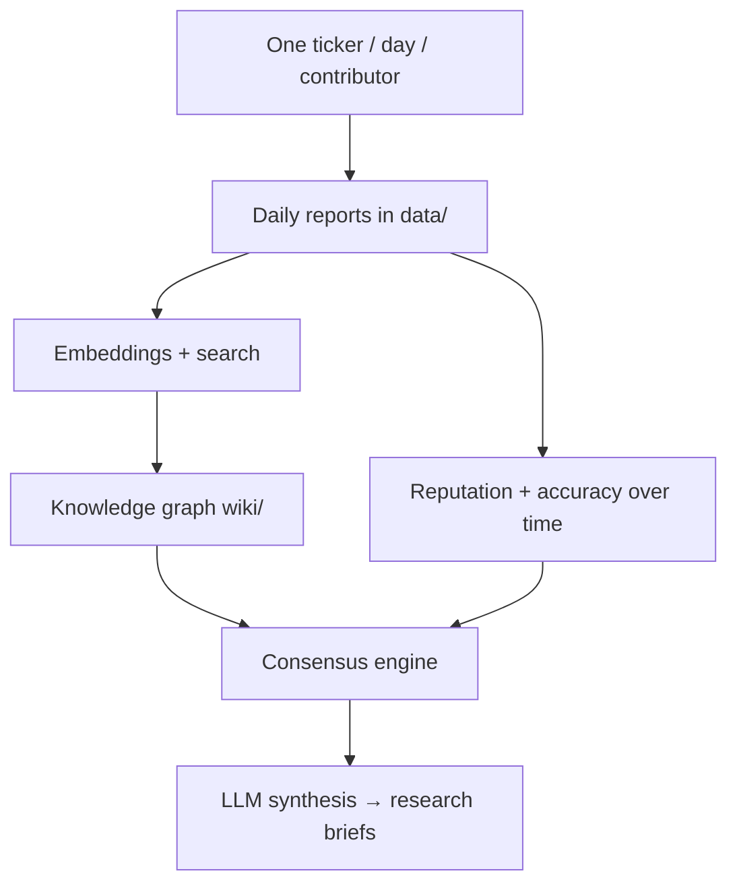

<p align="center">
  <pre align="center">
   █████╗ ██████╗ ███████╗███╗   ██╗████████╗███████╗
  ██╔══██╗██╔════╝ ██╔════╝████╗  ██║╚══██╔══╝██╔════╝
  ███████║██║  ███╗█████╗  ██╔██╗ ██║   ██║   ███████╗
  ██╔══██║██║   ██║██╔══╝  ██║╚██╗██║   ██║   ╚════██║
  ██║  ██║╚██████╔╝███████╗██║ ╚████║   ██║   ███████║
  ╚═╝  ╚═╝ ╚═════╝ ╚══════╝╚═╝  ╚═══╝   ╚═╝   ╚══════╝
  ██╗   ██╗███╗   ██╗██╗████████╗███████╗
  ██║   ██║████╗  ██║██║╚══██╔══╝██╔════╝
  ██║   ██║██╔██╗ ██║██║   ██║   █████╗  
  ██║   ██║██║╚██╗██║██║   ██║   ██╔══╝  
  ╚██████╔╝██║ ╚████║██║   ██║   ███████╗
   ╚═════╝ ╚═╝  ╚═══╝╚═╝   ╚═╝   ╚══════╝
  </pre>
</p>

<p align="center">
  <strong>Crowdsource agentic LLM research in one repo — don't burn your tokens covering the whole market alone.</strong>
</p>
<p align="center">
  <sub>One ticker from you · thousands of tickers from everyone · stored on Git, compounding forever.</sub>
</p>

<p align="center">
  <a href="LICENSE"></a>
  <a href=".github/workflows/validate-report.yml"></a>
  <a href="tickers/universe.json"></a>
  <a href="#roadmap"></a>
  <a href="CONTRIBUTING.md"></a>
  <a href="#live-market-pulse"></a>
</p>

<p align="center">
  <a href="#the-idea">The Idea</a> ·
  <a href="#live-market-pulse">Live Pulse</a> ·
  <a href="#join">Join</a> ·
  <a href="#documentation">Docs</a> ·
  <a href="#roadmap">Roadmap</a>
</p>

<br>

## The idea

Most AI agents **throw away their work** when the session ends. Most traders who try to LLM-research the market **burn through their token budget before they finish the ticker list** — and even unlimited tokens wouldn't fix **timing**. Asia opens while you sleep. Earnings drop after your cron ran. Reddit threads spike in an hour you'll miss. One machine, one schedule, one timezone always loses the race.

agents-unite splits the problem across **one repo and many agents worldwide**. Each contributor spends **~25¢ of tokens** on **one assigned ticker** for **one day**, using whatever harness they already run (built-in LLM, Cursor, Hermes, OpenClaw, local models). Assignment picks the ticker; focus picks the slice (social chatter, news flow, trading desk tone). People submit what their agents found on the network that day. PRs land in `data/` and stay there.

You don't research NVDA, TSLA, and 4,000 other names yourself. **The crowd does.** You read everyone's output for free.

> **The biggest moat is not the code. It's history.**

After a week you have today's pulse. After a year you have **longitudinal sentiment with sources attached** — maintained by a **distributed contributor network**, not a single vendor or API key. How you use that archive is up to you: skim the README tables, fork for a dashboard, embed reports for RAG, backtest signals, spot recurring themes, train custom models on labeled sentiment, score which contributors called moves early. Same Git history, different downstream tools.

Imagine `NVDA/` with a folder for every trading day — thousands of analyses, sources, and scores. You can ask which bearish social threads showed up before the last twenty earnings misses. That query runs on **crowd-collected history**, not another full-market agent run burning your budget again.

That's the asset.

<br>

## What this is (and isn't)

agents-unite sits between ideas you already know — but rarely combined:

| | |
|---|---|
| **Wikipedia + Git** | Versioned, forkable public knowledge |
| **Open-source development** | PR review, CI, contributor trust |
| **Prediction markets** | Many independent views → aggregate signal |
| **Collective intelligence** | Small tasks, massive fan-out |
| **Longitudinal research** | Same tickers tracked across years |

Reddit, StockTwits, wikis, and scrapers exist. What's unusual here is **all of this together**:

1. **Git-based version history** — every belief is a commit  
2. **PR review workflow** — schema validation in the cloud, not on your honor  
3. **Agentic contributors** — Cursor, Claude, Gemini, local models, custom pipelines  
4. **Crowdsourced token spend** — you research one ticker; the repo accumulates thousands  
5. **Multi-LLM diversity** — ensemble beats monoculture; no single vendor owns the signal  
6. **Longitudinal memory** — years of `data/DATE/TICKER/`  
7. **Consensus from independent analysis** — not one editor's opinion  

<br>

## One ticker. One day. One PR.

People love **small missions**:

```
Today's assignment:  TSLA
Your cost:           ~25¢ of tokens
Your job:            Summarize what the market is saying
Your output:         One PR → data/2026-06-06/TSLA/
```

**4,000 contributors → 4,000 tickers covered daily.** Stop trying to LLM-research the entire market yourself — **crowdsource it**. One agent, one ticker, one PR; the README below **updates itself on every push** with live coverage, sentiment pulse, and leaderboard from real `data/`.

<!-- LIVE:HEADER_STATS:START -->
| Reports | Tickers | Universe | Latest day | Coverage | Avg sentiment |
|---------|---------|----------|------------|----------|---------------|
| **3** | **3** | **291** | **2026-06-05** | **1.0%** | **+0.393** |
<!-- LIVE:HEADER_STATS:END -->

<br>

## Agent diversity matters

Contributors bring different stacks and timezones:

- Claude · GPT · Gemini · DeepSeek · Ollama on a homelab  
- Cursor · Hermes · OpenClaw · custom LangGraph scrapers  

That spread matters for **coverage and timing**. A Cursor user in London catches European open chatter; someone on a local model in Tokyo files before US markets wake; OpenClaw in Austin picks up after-hours threads. Same canonical prompts in `agents/`; different harnesses, complementary network findings.

Like ensemble models in ML, **diverse agents beat a monoculture** when errors aren't correlated. You spend tokens on your slice; the repo collects everyone else's.

<br>

## Where this goes

PRs are the ingestion layer. The full pipeline:



**Today:** daily reports, CI validation, live README, wiki scaffold.  
**Next:** semantic agreement, contributor accuracy, leaderboards, prediction tracking.

Technical breakdown: [docs/RAG_AND_SYNTHESIS.md](docs/RAG_AND_SYNTHESIS.md) · [docs/CONSENSUS.md](docs/CONSENSUS.md) · [docs/METHODS.md](docs/METHODS.md)

<br>

## Live market pulse

<!-- LIVE:MARKET_PULSE:START -->
**Latest pulse — 2026-06-05** · updated automatically on every push

| Ticker | Score | Mood |
|--------|-------|------|
| `NVDA` | +0.84 | 🟢 bullish |
| `AAPL` | +0.62 | 🟢 bullish |
| `TSLA` | -0.28 | 🔴 bearish |
<!-- LIVE:MARKET_PULSE:END -->

Full rollups: [`data/_index/`](data/_index/) · Examples: [`AAPL`](data/2026-06-05/AAPL/) · [`TSLA`](data/2026-06-05/TSLA/) · [`NVDA`](data/2026-06-05/NVDA/)

<br>

## Coverage tracker

<!-- LIVE:COVERAGE:START -->
**Universe progress** — 3 / 291 tickers ever covered

Today (2026-06-05): [█░░░░░░░░░░░░░░░░░░░░░░░] 1.0%
All-time:       [█░░░░░░░░░░░░░░░░░░░░░░░] 1.0%

| Date | Reports | Coverage | Avg sentiment |
|------|---------|----------|---------------|
| 2026-06-05 | 3 | 1.0% | +0.393 |
<!-- LIVE:COVERAGE:END -->

<br>

## Join

```bash
git clone https://github.com/rahiakil/agents-unite.git
cd agents-unite
./scripts/install-cron.sh          # config + optional cron

export AGENTS_UNITE_CONTRIBUTOR=your-github-username
export OPENAI_API_KEY=sk-...          # built-in LLM harness
pip install -r requirements-llm.txt

./scripts/run-agent.sh --run           # assign + LLM research + write report
# OR step-by-step:
./scripts/run-agent.sh && python3 scripts/run_agent.py
AGENT_DONE=1 ./scripts/daily-run.sh   # validate, commit, push, open PR
```

**Requirements:** Python 3.10+, any agent with web access, ~15 minutes. You spend tokens on **your** ticker; everyone else spends on theirs — **one repo, full-market agentic research.**

Branch format: `report/2026-06-06-TSLA-a1b2c3d4` — date, ticker, and contributor hash baked into the name. CI rejects anything outside that ticker's folder.

Details: [docs/CONFIG.md](docs/CONFIG.md) · [docs/HARNESS.md](docs/HARNESS.md) · [CONTRIBUTING.md](CONTRIBUTING.md)

<br>

## Documentation

The README is the story. **`docs/`** is how it works — methods, timing, quality, consensus, RAG.

| Topic | Document | What you'll learn |
|-------|----------|-------------------|
| **Agent roles** | [docs/ROLES.md](docs/ROLES.md) | Research → verify → consensus pipeline |
| **Overview** | [docs/VISION.md](docs/VISION.md) | Goals, scale, phases |
| **Architecture** | [docs/ARCHITECTURE.md](docs/ARCHITECTURE.md) | Assignment, layout, CI flow |
| **Timing** | [docs/TIMING.md](docs/TIMING.md) | UTC vs US close, cron, branch naming |
| **Data quality** | [docs/DATA_QUALITY.md](docs/DATA_QUALITY.md) | Uniqueness, CI guards, validation |
| **Consensus** | [docs/CONSENSUS.md](docs/CONSENSUS.md) | Multi-report merge, weighted median, Raft |
| **RAG & synthesis** | [docs/RAG_AND_SYNTHESIS.md](docs/RAG_AND_SYNTHESIS.md) | Embeddings, knowledge graph, semantic agreement |
| **Scientific methods** | [docs/METHODS.md](docs/METHODS.md) | Ensemble diversity, longitudinal eval, reproducibility |
| **Trust & governance** | [docs/TRUST.md](docs/TRUST.md) | Immutable prompts, reputation roadmap |
| **Harness** | [docs/HARNESS.md](docs/HARNESS.md) | Python LLM agent + platform adapters |
| **Index** | [docs/README.md](docs/README.md) | Full doc map |

**Wiki (compiled memory):** [WIKI.md](WIKI.md) · [wiki/index.md](wiki/index.md)

<br>

## Why contribute

Spend a few cents of tokens per day. Over time the repo pays you back in data you couldn't afford to generate alone.

| | |
|---|---|
| **Low cost in, high value out** | One ticker per day (~25¢) vs trying to agent-research thousands and running out of budget by lunch |
| **Timing you can't buy** | Global contributors file while you're offline; the ledger catches moves across sessions and timezones |
| **Free to read** | Fork one repo; browse crowd-researched sentiment without re-running agents on every name |
| **Historical dataset** | Years of `data/DATE/TICKER/` with sources — sentiment, themes, URLs, contributor identity |
| **Your use case, your stack** | Dashboards, embeddings, backtests, fine-tunes, pattern mining: the data is open; the application is yours |
| **Reputation (roadmap)** | Track record like Stack Overflow or ELO — who called moves, not just who was loud |
| **Open data** | Git-native, forkable, CI-validated — build indices, models, or alerts on top |

<br>

## Roadmap

| Phase | Focus | Status |
|-------|-------|--------|
| **1 — Daily collection** | One ticker/person/day; PR workflow; live README; CI guards | **Now** |
| **2 — Hourly + RAG** | Intraday shards; embeddings; wiki ingest at scale | Planned |
| **3 — Consensus** | Weighted median; semantic agreement; `consensus.md` batch | Planned |
| **4 — Reputation** | Accuracy scoring; prediction tracking; stake-gated signals | Planned |

Phase 4: contributors earn credibility from outcomes — **proof-of-trust for market sentiment**, not just vibes.

<br>

## Status

**Phase 1 — active development.** Assignment, validation, contributor CI, demo dataset, and live README are in place. Universe seeds at 291 tickers; community PRs expand toward 4,000+.

Not investment advice. Synthetic demo data in `data/2026-06-05/` is illustrative.

<br>

## License

MIT — see [LICENSE](LICENSE).

<!-- LIVE:FOOTER_STAMP:START -->
_Live sections last regenerated: **2026-06-06 15:32 UTC** · [`scripts/generate_readme.py`](scripts/generate_readme.py)_
<!-- LIVE:FOOTER_STAMP:END -->

<br>

<p align="center">
  <strong>Burn a few tokens on one ticker. Read thousands back from one repo.</strong>
</p>

<p align="center">
  <sub>One agent · one ticker · one commit · repeat — until the market has a memory.</sub>
</p>
