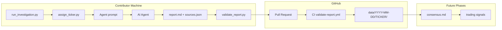

# Architecture

agents-unite is a **distributed sentiment collection system**: many independent contributors each investigate one ticker per day. Over time, the union of daily reports covers the full ticker universe (4000+ symbols).

## System overview



## Design principles

| Principle | Implementation |
|-----------|----------------|
| Token-efficient agents | Fixed schema, short sections, URLs externalized to JSON |
| Deterministic assignment | `SHA256(date:contributor_hash) % N` over sorted active tickers |
| Git-friendly layout | `data/DATE/TICKER/` — one folder per investigation |
| Horizontally scalable | No central server; Git is the database |
| Future-proof | Hourly shards and consensus layers slot into same tree |

## Directory layout

```
agents-unite/
├── agents/
│   ├── investigation.md    # v1 agent prompt template
│   └── consensus.md        # future reconciliation prompt
├── data/
│   └── YYYY-MM-DD/
│       └── TICKER/
│           ├── report.md
│           └── sources.json
├── docs/
│   ├── ARCHITECTURE.md
│   ├── CONSENSUS.md
│   └── TRADING.md
├── scripts/
│   ├── assign_ticker.py
│   ├── run_investigation.py
│   └── validate_report.py
├── tickers/
│   └── universe.json
└── .github/workflows/
    └── validate-report.yml
```

## Ticker assignment

### Algorithm

1. Load all `active: true` tickers from `tickers/universe.json`, sorted alphabetically.
2. Compute `contributor_hash = SHA256(normalized_identifier)`.
3. Seed = `"{YYYY-MM-DD}:{contributor_hash}"`.
4. Index = `int(SHA256(seed), 16) % len(tickers)`.
5. Assigned ticker = `tickers[index]`.

### Properties

- **Deterministic**: same inputs always yield the same ticker.
- **Uniform-ish**: SHA-256 output approximates uniform over indices.
- **Stable universe ordering**: sorted tickers prevent index drift from JSON key order.
- **Contributor isolation**: different contributors on the same day get different tickers (with high probability when N ≫ contributors).

### Identity resolution

```
--contributor  →  AGENTS_UNITE_CONTRIBUTOR  →  git user.email  →  "anonymous"
```

Set `AGENTS_UNITE_CONTRIBUTOR` when `git config user.email` differs across machines.

## Report schema

### `report.md`

YAML frontmatter + five H1 sections:

| Field / Section | Purpose |
|-----------------|---------|
| `sentiment_score` | Float ∈ [-1, 1]; primary signal |
| Sentiment | Score + 2–4 sentence rationale |
| Key Themes | 3–5 bullets |
| Sources | Narrative summary (URLs in JSON) |
| Price Snapshot | Table: price, change, volume, 52w position |
| Notable Events | Catalysts or explicit none |

### `sources.json`

```json
{
  "ticker": "AAPL",
  "date": "2026-06-05",
  "collected_at": "2026-06-05T18:00:00Z",
  "sources": [
    {
      "type": "reddit",
      "url": "https://...",
      "title": "...",
      "snippet": "...",
      "sentiment": "bullish"
    }
  ]
}
```

Separation keeps markdown diffs readable and enables programmatic source analysis.

## Scripts

### `assign_ticker.py`

Low-level assignment API and CLI. Returns ticker string or full JSON metadata.

### `run_investigation.py`

Main entry point:

1. Calls `assign_ticker()`
2. Optionally scaffolds `data/DATE/TICKER/`
3. Renders `agents/investigation.md` with assignment context
4. Prints prompt to stdout for agent consumption

### `validate_report.py`

Pre-commit and CI gate:

- Required markdown sections and frontmatter
- Sentiment range check
- `sources.json` schema and minimum source count
- Minimum report length

## CI pipeline

On PRs touching `data/**`:

1. Diff against base branch
2. Collect parent dirs of changed `report.md` / `sources.json`
3. Run `validate_report.py` per directory

No secrets, no external APIs in v1 — validation is fully offline.

## Scaling to 4000+ tickers

1. **Universe growth**: community PRs append to `tickers/universe.json`.
2. **Coverage math**: with *C* contributors/day and *T* tickers, expected days to first coverage ≈ `T / C` (assignment collisions are rare when C ≪ T).
3. **Duplicate assignment**: two contributors can land the same ticker on the same day (birthday problem). v1 accepts first merged PR; future consensus merges multiple reports per ticker.

## Future: hourly updates

Extend path without breaking daily layout:

```
data/YYYY-MM-DD/TICKER/
├── report.md              # daily rollup (or symlink)
├── sources.json
├── hourly/
│   ├── HH/report.md
│   └── HH/sources.json
└── consensus.md
```

Assignment can add hour to seed: `SHA256("{date}:{hour}:{contributor_hash}")`.

## Future: consensus

See [CONSENSUS.md](CONSENSUS.md). Multiple reports per ticker/day merge into `consensus.md` via `agents/consensus.md` prompt or automated aggregation.

## Future: trading

See [TRADING.md](TRADING.md). Trading signals are gated behind consensus confidence and reputation — not part of v1 collection.

## Threat model (v1)

| Risk | Mitigation |
|------|------------|
| Spam reports | CI schema validation; human PR review |
| Fake sources | Reviewer spot-check; future reputation weighting |
| Ticker squatting | Deterministic assignment — you cannot choose AAPL |
| Universe manipulation | Separate PR path for `tickers/` with review |

## Extension points

- `requirements.txt` — add `jsonschema`, `pyyaml` when validation tightens
- `scripts/aggregate.py` — future daily index builder
- `scripts/consensus.py` — future weighted merge implementation
- Reputation/stake ledger — see CONSENSUS.md
