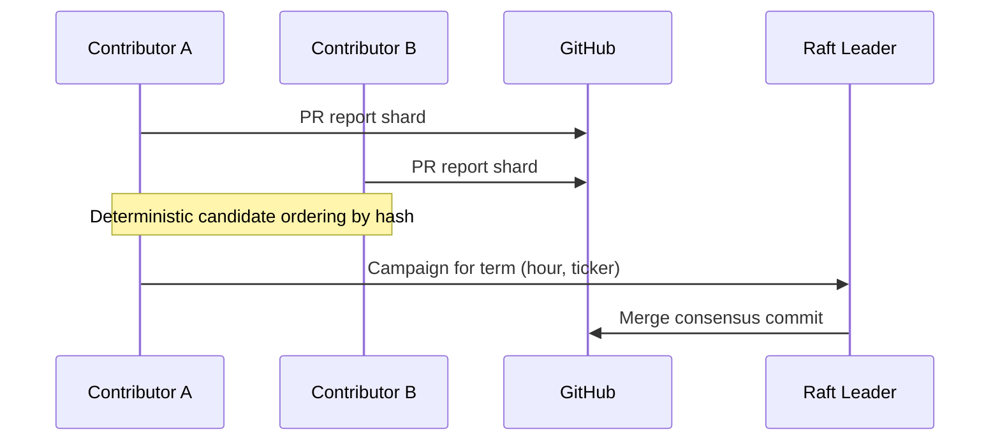

# Consensus Design

**Status:** B + C locked — multiple `report.<user>.md` allowed; verifiers produce `consensus.md`. See [raw/DECISIONS.md](../raw/DECISIONS.md).

v1 collects **independent** sentiment reports. This document describes how multiple reports for the same ticker/day merge into a **consensus signal** — a prerequisite for any downstream trading use.

## Motivation

A single agent report is noisy. Consensus:

- Reduces outlier bias
- Surfaces agreement vs disagreement
- Produces one canonical score per ticker per time window
- Enables reputation tracking for contributors

## When consensus runs

| Phase | Trigger | Output |
|-------|---------|--------|
| v1 | Manual / none | N/A |
| v2 | Nightly batch per `data/YYYY-MM-DD/TICKER/` | `consensus.md` |
| v3 | Hourly + Raft leader election | `hourly/HH/consensus.md` |

## Input artifacts

For ticker `T` on date `D`:

```
data/D/T/
├── report.<contributor_hash>.md   # optional multi-report layout
├── sources.<contributor_hash>.json
├── report.md                      # v1: single report
├── sources.json
└── consensus.md                   # output
```

v2 may keep v1 filenames and add suffixed variants when multiple contributors collide on the same assignment.

## Consensus agent

Prompt template: [`agents/consensus.md`](../agents/consensus.md)

The consensus agent (or `scripts/consensus.py` batch job):

1. Loads all valid reports for `(D, T)`
2. Extracts `sentiment_score` and themes
3. Writes `consensus.md` with merged metadata

## Scoring algorithm

### Step 1 — Validate inputs

Only include reports passing `validate_report.py`.

### Step 2 — Outlier rejection (n ≥ 3)

Compute median *m* and median absolute deviation (MAD). Drop scores where `|x - m| > 2 × MAD`.

### Step 3 — Weighted median

| Era | Weight |
|-----|--------|
| v2 | 1.0 per report |
| v3+ | `stake × reputation × recency` |

**Consensus score** = weighted median of remaining scores.

### Step 4 — Confidence label

| Label | Condition |
|-------|-----------|
| `high` | n ≥ 3 after filtering, score spread ≤ 0.4 |
| `medium` | n = 2, or spread ≤ 0.7 |
| `low` | n = 1, or spread > 0.7 |

Spread = max(score) − min(score) after filtering.

## Output schema (`consensus.md`)

```markdown
---
ticker: AAPL
date: 2026-06-05
consensus_score: 0.35
report_count: 4
confidence: high
method: weighted_median
contributors: ["abc123", "def456"]
---

# Consensus Sentiment
# Agreement
# Divergence
# Merged Themes
# Source Coverage
# Price Snapshot
# Notable Events
```

## Raft / leader election (v3)

Hourly updates need a single writer per `(D, T, H)` shard to avoid git conflicts.

### Proposed model



**Leader selection** (deterministic, no network):

```
leader = argmin(SHA256("{date}:{hour}:{ticker}:{contributor_hash}"))
```

among contributors who submitted a valid report that hour. The leader runs the consensus agent and opens the merge PR.

This is **proof-of-work-free** coordination: Git + deterministic tie-breaking, not a blockchain.

## Proof-of-stake alignment

Longer term, contributors earn **reputation** from:

- Report frequency and validation pass rate
- Proximity to consensus (after the fact)
- Peer review approvals

**Stake** (optional, future) gates:

- Who may run consensus merges
- Weight in weighted median
- Eligibility for trading signal consumption

No token is defined in v1. Reputation is off-chain: a JSON ledger in `contributors/reputation.json` updated by maintainers or automated scoring.

## Source deduplication

`sources.json` files merge into a canonical list:

- Dedupe by normalized URL
- Keep highest-snippet-quality entry
- Tag with contributing `contributor_hash`

## Failure modes

| Scenario | Behavior |
|----------|----------|
| Single report | `consensus_score` = that score; `confidence: low` |
| All reports outliers | Fall back to unfiltered median; `confidence: low` |
| Conflicting themes | Document in Divergence; do not force agreement |
| No reports | No consensus file |

## Implementation checklist

- [ ] `scripts/consensus.py` — batch aggregator (no LLM)
- [ ] `agents/consensus.md` — LLM reconciliation for theme merging
- [ ] Multi-report filename convention
- [ ] CI job: generate consensus when ≥ 2 reports exist
- [ ] Reputation ledger schema
- [ ] Hourly shard assignment in `assign_ticker.py`

## Non-goals (v2)

- On-chain staking
- Real-time streaming
- Automatic trade execution

See [TRADING.md](TRADING.md) for how consensus gates trading.
