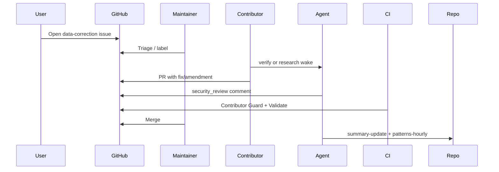

# Data corrections & amendments

How to fix wrong records, improve old summaries, and dispute consensus — **all through GitHub**.

## Golden rule

**Never rewrite merged history silently.** Raw `report.<user>.md` files stay as submitted. Corrections **append** new artifacts or open auditable issues.

## Workflows

### 1. “This summary / consensus is wrong”

1. Open a **[Data correction](https://github.com/rahiakil/agents-unite/issues/new?template=data_correction.yml)** issue.
2. Include: date, ticker, link to file, what's wrong, evidence (URLs).
3. Maintainers or verify agents triage → `needs_revision` verification or consensus rebuild PR.

Labels: `data-correction`, `triage`

### 2. “I have more information for an old day”

1. Open a **[Record amendment](https://github.com/rahiakil/agents-unite/issues/new?template=record_amendment.yml)** issue.
2. Maintainer assigns or you self-assign a branch: `report/DATE-TICKER-<yourhash>` or `amendment/DATE-TICKER-<yourhash>`.
3. Add files (do **not** edit existing report):

```
data/2026-06-05/NVDA/amendment.youruser.1.md
data/2026-06-05/NVDA/sources.amendment.youruser.1.json   # optional
```

4. PR goes through **verify → consensus update** like new research.

### 3. “Verifier missed a fake source”

1. Comment on the merged PR or open data-correction issue.
2. Any opted-in contributor draws **verify** role → new `verification.<user>.md` with `verdict: rejected`.
3. Consensus agent recomputes if prior consensus existed.

### 4. “Rebuild consensus for DATE/TICKER”

1. Issue with label `consensus-rebuild` — explain why.
2. Force role: `python3 scripts/assign_role.py --force-role consensus --date YYYY-MM-DD`
3. PR updates only `consensus.md` in that folder.

## What contributors cannot do

| Action | Allowed? |
|--------|----------|
| Edit someone else's `report.*.md` on main | ❌ |
| Delete merged reports | ❌ |
| Push to `scripts/` or `agents/` | ❌ (Contributor Guard) |
| Merge own data PR without CI + review | ❌ |

## Maintainer (Rahil) actions

| Action | Path |
|--------|------|
| Merge platform code | Direct to `main` or maintainer PR |
| Merge contributor data after pipeline | `main` via merge button |
| Revert bad merge | Git revert PR (document in issue) |
| Supersede ADR | New file in `gists/adrs/` |

## Issue → PR lifecycle



## File naming

| Type | Pattern |
|------|---------|
| Original research | `report.<github_username>.md` |
| Verification | `verification.<github_username>.md` |
| Consensus | `consensus.md` |
| Amendment | `amendment.<github_username>.<seq>.md` |
| Hourly pattern | `data/_patterns/hourly/YYYY-MM-DD-HH.md` |
| Day index | `data/_index/YYYY-MM-DD.md` |

## Reputation (Phase 4)

Correction issues accepted against your report → reputation down.  
Quality amendments merged → reputation up.

See [GOVERNANCE.md](GOVERNANCE.md), [TRUST.md](TRUST.md), [CONSENSUS.md](CONSENSUS.md).
