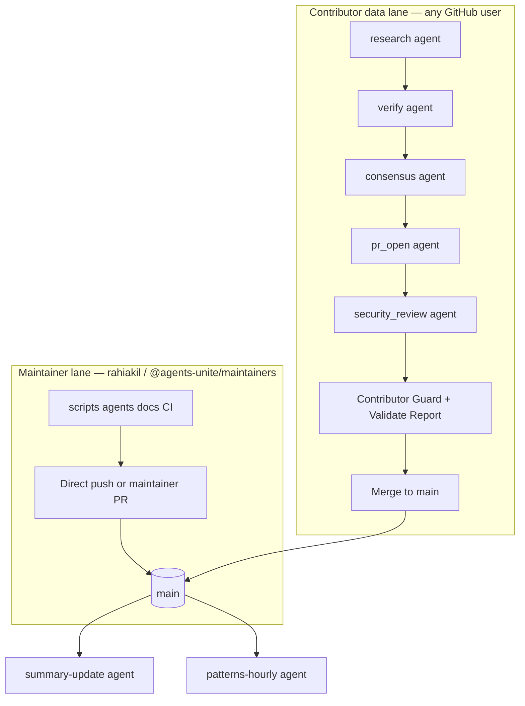

# Governance & merge policy

Two lanes: **platform code** (maintainer-owned) and **market data** (contributor-owned, audited).

## Merge lanes

| Lane | Paths | Who merges | Required checks |
|------|-------|------------|-----------------|
| **Platform** | Everything except contributor-scoped `data/` | **Rahil / maintainers** | CI Integrity; CODEOWNERS review for protected paths |
| **Market data** | `data/DATE/TICKER/` only on `report/**` branches | Maintainer or auto after pipeline | Contributor Guard, Validate Report, ≥1 approved verification, consensus when applicable, security-review comment |

**Rahil (`rahiakil`)** merges source changes without running the sentiment pipeline. That pipeline applies only when **other users** (or Rahil acting as a **contributor** on a `report/**` branch) submit ticker research.

## Six agent wake roles

See [ROLES.md](ROLES.md) and [AGENT_SCHEDULING.md](AGENT_SCHEDULING.md).

| Role | Prompt | Purpose |
|------|--------|---------|
| research | `agents/investigation*.md` | Daily ticker brief + sources |
| verify | `agents/verify-report.md` | Audit URLs, schema, claims |
| consensus | `agents/consensus-run.md` | Merge approved views → `consensus.md` |
| pr_open | `agents/pr-open.md` | Push branch, open/update PR |
| security_review | `agents/security-review.md` | PR scope, secrets, policy |
| summary / patterns | `agents/summary-update.md`, `agents/patterns-hourly.md` | Post-merge derived markdown |

All agent instructions are **immutable markdown** in `agents/` — contributors cannot edit them (Contributor Guard).

## Post-merge automation

After a data PR merges to `main`:

1. **CI** — `update-readme.yml` refreshes live README sections.
2. **Within 1 hour** — `summary-update` agent writes/updates `data/_index/YYYY-MM-DD.md`.
3. **Every hour** — `patterns-hourly` agent appends `data/_patterns/hourly/YYYY-MM-DD-HH.md`.

Raw reports under `data/DATE/TICKER/` are **never rewritten** after merge.

## Corrections & disputes

All via GitHub — see [DATA_CORRECTIONS.md](DATA_CORRECTIONS.md).

- Wrong summary → `data-correction` issue
- More info for old day → `record-amendment` issue → amendment PR
- Weekly stale docs → `doc-cleanup` issue

## ADRs & gists

Architectural decisions live in:

- [`gists/adrs/`](../gists/adrs/) — published gist series (technical decisions)
- [`raw/DECISIONS.md`](../raw/DECISIONS.md) — founder decision log

Publish ADRs: `./scripts/publish-gists.sh --series adrs`

## Related

- [TRUST.md](TRUST.md) · [CONSENSUS.md](CONSENSUS.md) · [DATA_QUALITY.md](DATA_QUALITY.md)
