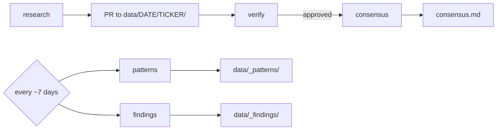

# Agent Roles & Pipeline

When cron wakes up, each contributor gets **one role** for that run. You do not choose in advance (unless `roles_opt_in: false` → always research).

## Pipeline order



| Stage | Role | Output | When |
|-------|------|--------|------|
| 1 | **research** | `report.<user>.md` + `sources.<user>.json` | Most days (~65% if opted in) |
| 2 | **verify** | `verification.<user>.md` with verdict | ~20% of opted-in days |
| 3 | **consensus** | `consensus.md` | ~15% — after verifications exist |
| Weekly | **patterns** | `patterns.<user>.md` in `data/_patterns/DATE/` | ~1 day per 7 (staggered) |
| Weekly | **findings** | `findings.<user>.md` in `data/_findings/DATE/` | ~1 day per 7 (staggered) |
| Post-research | **pr_open** | GitHub PR opened/updated | After local validation passes |
| Pre-merge | **security_review** | PR comment (approve / request_changes) | On open data PRs |
| Hourly | **summary_update** | `data/_index/YYYY-MM-DD.md` | :15 each hour UTC (maintainer node) |
| Hourly | **patterns_hourly** | `data/_patterns/hourly/YYYY-MM-DD-HH.md` | Each hour UTC |

**Merge policy:** Maintainer (`rahiakil`) merges **platform code** directly. **Contributor data** must complete research → verify → consensus → PR → security review → CI. See [GOVERNANCE.md](GOVERNANCE.md).

## Research (not sentiment-only)

Research agents produce a **daily brief**: sentiment score, themes, news/social context, price snapshot, catalysts. Focus is split (social / news / trading / sentiment / full) so collisions become complementary slices.

Prompts: `agents/investigation*.md`

## Verify

Verifiers **audit** existing reports in their assigned ticker folder:

- Source URLs real and on-topic
- Numbers match citations
- Schema complete

They write `verification.<user>.md` with `verdict: approved | needs_revision | rejected`.

They do **not** write `consensus.md`.

Prompt: `agents/verify-report.md`

## Consensus

Consensus agents run **after** at least one `verification*.md` with `approved` exists for that ticker/day. They merge approved research into `consensus.md` (weighted median, divergence preserved).

Assignment prefers folders with reports + verifications pending consensus (`find_consensus_target()` in `scripts/au_common.py`).

Prompt: `agents/consensus-run.md`

## Weekly roles

Every **7 days** (hash-staggered per contributor, not everyone same calendar day):

| Role | Mission |
|------|---------|
| **patterns** | Cross-ticker themes over the last week |
| **findings** | Breaking news and non-obvious discoveries |

Branches: `weekly/patterns/DATE-HASH`, `weekly/findings/DATE-HASH`

Prompts: `agents/patterns-weekly.md`, `agents/findings-weekly.md`

## PR open & security review

| Role | Prompt | Output |
|------|--------|--------|
| **pr_open** | `agents/pr-open.md` | Push branch, `gh pr create`, labels |
| **security_review** | `agents/security-review.md` | PR comment with scope/secrets verdict |

## Hourly downstream agents

| Role | Prompt | Output |
|------|--------|--------|
| **summary_update** | `agents/summary-update.md` | `data/_index/DATE.md` |
| **patterns_hourly** | `agents/patterns-hourly.md` | `data/_patterns/hourly/DATE-HH.md` |

Scheduling: [AGENT_SCHEDULING.md](AGENT_SCHEDULING.md)

## Configuration

`.agents-unite/config.yaml`:

```yaml
github_username: your-handle
roles_opt_in: true    # enables random verify / consensus / weekly lottery
# legacy key still works:
verifier_opt_in: true
```

| `roles_opt_in` | Behavior |
|----------------|----------|
| `false` | Always **research** (except weekly day still applies) |
| `true` | Random **verify** (~20%), **consensus** (~15%), else **research** |

## Branch names

| Role | Branch format |
|------|---------------|
| research / verify / consensus | `report/DATE-TICKER-<hash8>` |
| patterns | `weekly/patterns/DATE-<hash8>` |
| findings | `weekly/findings/DATE-<hash8>` |

## Commands

```bash
python3 scripts/assign_role.py --json
./scripts/run-agent.sh
python3 scripts/assign_role.py --force-role verify --json
python3 scripts/assign_role.py --force-role consensus --json
python3 scripts/assign_role.py --force-role patterns --json
```

See [TIMING.md](TIMING.md), [CONSENSUS.md](CONSENSUS.md), [CONFIG.md](CONFIG.md).
